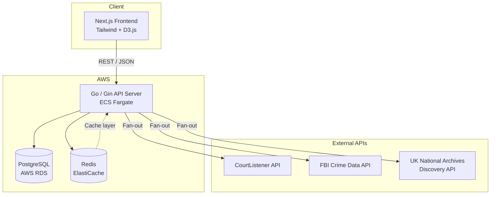
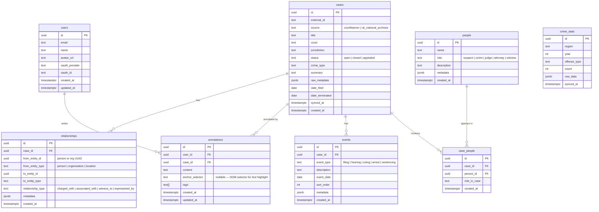

# 🕵️ I Am Detective — Product Requirements Document

> **Detective-mode criminal case explorer** — Browse real open legal cases, read structured dossiers, explore visual relationship graphs, build auto-generated timelines, and annotate evidence.

---

## 1. Product Overview

**I Am Detective** is a desktop-first web application that transforms raw public legal data into an immersive, investigation-style experience. Users can browse thousands of real criminal cases sourced from CourtListener, the FBI Crime Data Explorer, and the UK National Archives, then dive deep into structured dossiers with auto-generated timelines, suspect profiles, and interactive relationship graphs.

### Core Value Proposition

| For | Value |
|-----|-------|
| True-crime enthusiasts | Explore real cases in a cinematic, detective-board UX |
| General public | Understand legal proceedings through structured, visual summaries |
| Students & researchers | Cross-reference cases and annotate evidence for study |

---

## 2. User Personas

### Persona 1 — "The Armchair Detective" (Primary)
- **Who:** True-crime podcast listener, 22-40 yrs old
- **Goal:** Deep-dive into real cases with a rich, interactive UI
- **Pain:** Raw court filings are dense; no tool ties everything together visually

### Persona 2 — "The Curious Citizen" (Secondary)
- **Who:** General public interested in how the legal system works
- **Goal:** Browse and understand cases without legal expertise
- **Pain:** Legal databases are built for lawyers, not regular people

---

## 3. User Flows

### 3.1 Onboarding & Authentication
```
Landing Page → "Sign In with Google/GitHub" (OAuth 2.0)
  → First-time: brief onboarding tooltip tour
  → Returning: redirect to Dashboard
```

### 3.2 Case Discovery
```
Dashboard → Browse / Search / Filter cases
  → Filter by: jurisdiction, date range, crime type, source (US/UK)
  → Search: full-text search across case titles, descriptions, parties
  → Sort: date filed, relevance, most viewed
  → Paginated results with case cards (title, court, date, crime type badge)
```

### 3.3 Case Dossier View
```
Click case card → Structured Dossier Page
  ├── Header: Case title, court, filing date, status badge
  ├── Tab: Summary — structured plain-English breakdown
  ├── Tab: People — suspects, victims, judges, attorneys (card grid)
  ├── Tab: Timeline — auto-generated chronological event strip
  ├── Tab: Evidence & Documents — linked court filings, PDFs
  ├── Tab: Relationship Graph — interactive force-directed graph
  └── Tab: My Notes — private annotations (rich text)
```

### 3.4 Relationship Graph
```
Dossier → "Relationships" tab
  → Force-directed graph (D3.js / react-force-graph)
  → Nodes: people, organizations, locations, charges
  → Edges: "charged with", "associated with", "witness to", etc.
  → Click node → side-panel with details + link to other cases
  → Zoom / pan / filter by node type
```

### 3.5 Timeline
```
Dossier → "Timeline" tab
  → Auto-generated from case filing dates, hearing dates, rulings
  → Vertical timeline with event cards
  → Each card: date, event type icon, description
  → Color-coded by event type (filing, hearing, ruling, arrest)
```

### 3.6 Annotations
```
Any dossier tab → Click "Add Note" or select text
  → Rich-text annotation editor (private to user)
  → Tags: custom user tags for organization
  → Annotations appear in sidebar & "My Notes" tab
  → Searchable from dashboard
```

### 3.7 Cross-Reference
```
Any person/entity node in graph → "Find in other cases"
  → Shows list of cases where this entity appears
  → Side-by-side comparison mode (future)
```

---

## 4. Tech Stack & Rationale

| Layer | Technology | Why |
|-------|-----------|-----|
| **Frontend** | Next.js 14 (App Router) + Tailwind CSS | SSR for SEO, file-based routing, rapid UI development |
| **Graph Visualization** | `react-force-graph-2d` or D3.js | Battle-tested force-directed graph rendering |
| **Timeline** | `react-chrono` or custom | Clean vertical timeline component |
| **Backend API** | Go + Gin | High concurrency for API fan-out, low memory footprint, fast cold starts |
| **Database** | PostgreSQL (AWS RDS) | Relational data model fits case→person→event relationships; JSONB for flexible metadata |
| **Cache** | Redis (ElastiCache) | Cache API responses (CourtListener rate-limited to 5k/hr), session store |
| **Auth** | OAuth 2.0 (Google + GitHub) via `golang.org/x/oauth2` | No password management overhead; familiar for target audience |
| **External APIs** | CourtListener, FBI CDE, UK National Archives | Three complementary data sources (US case law, US crime stats, UK historical records) |
| **Deployment** | AWS (ECS/Fargate for Go, Amplify or Vercel for Next.js, RDS, ElastiCache) | User's preferred cloud; managed services reduce ops |
| **CI/CD** | GitHub Actions | Free for public repos, solid Docker + AWS integration |

### Architecture Diagram



---

## 5. Data Ingestion Strategy

> **Recommendation**: Batch sync + Redis caching (not purely on-demand).

### Why Batch Sync?
- CourtListener rate-limits to **5,000 req/hr** — on-demand fetching would hit limits quickly with concurrent users
- FBI data is **aggregate statistics** — changes infrequently, perfect for nightly sync
- UK National Archives allows **3,000 req/day** — must be cached aggressively

### Sync Architecture

| Source | Sync Strategy | Frequency | Storage |
|--------|--------------|-----------|---------|
| CourtListener | Background Go worker pulls case law via paginated API; stores in Postgres | Every 6 hours | `cases`, `people`, `events` tables |
| FBI Crime Data | Nightly batch pull of crime stats by region/year | Daily | `crime_stats` table |
| UK National Archives | On-demand fetch + Redis cache (TTL 24h); background enrichment worker | On-demand + nightly | `uk_cases` table + Redis |

### Redis Cache Layers

| Key Pattern | TTL | Purpose |
|-------------|-----|---------|
| `case:{id}` | 1 hour | Individual case detail |
| `search:{hash}` | 15 min | Search result pages |
| `graph:{case_id}` | 30 min | Pre-computed graph data |
| `stats:{region}:{year}` | 24 hours | FBI crime statistics |

---

## 6. Database Schema Outline



### Key Indexes

| Table | Index | Purpose |
|-------|-------|---------|
| `cases` | `(source, external_id)` UNIQUE | Dedup external data |
| `cases` | GIN on `title`, `summary` | Full-text search |
| `cases` | `(crime_type, date_filed)` | Filtered browsing |
| `case_people` | `(case_id)`, `(person_id)` | Join lookups |
| `events` | `(case_id, event_date)` | Timeline queries |
| `annotations` | `(user_id, case_id)` | User's notes per case |
| `relationships` | `(case_id)` | Graph construction |

---

## 7. API Integration Plan

### 7.1 CourtListener (Primary — US Case Law)

| Detail | Value |
|--------|-------|
| **Base URL** | `https://www.courtlistener.com/api/rest/v4/` |
| **Auth** | Token-based (`Authorization: Token <key>`) |
| **Rate Limit** | 5,000 req/hr (authenticated) |
| **Key Endpoints** | |
| Search opinions | `GET /search/?type=o&q={query}` |
| Case detail | `GET /opinions/{id}/` |
| Docket (full case) | `GET /dockets/{id}/` |
| Parties & attorneys | `GET /parties/?docket={id}` |
| People (judges) | `GET /people/{id}/` |
| Citation network | `GET /citations/?citing_opinion={id}` |

**Mapping to our schema:**
- `dockets` → `cases` table (title, court, dates, status)
- `parties` → `people` + `case_people` tables
- `opinions` → `events` (ruling type)
- `citations` → `relationships` (case-to-case edges)

### 7.2 FBI Crime Data Explorer (Supplementary — US Crime Stats)

| Detail | Value |
|--------|-------|
| **Base URL** | `https://api.usa.gov/crime/fbi/sapi/` |
| **Auth** | API key as query param (`?API_KEY=...`) |
| **Rate Limit** | Generous (public data) |
| **Key Endpoints** | |
| Offense stats by state | `GET /api/estimates/states/{state_abbr}/{variable}` |
| Agency-level data | `GET /api/agencies/byStateAbbr/{state}` |
| National stats | `GET /api/estimates/national` |

**Usage in app:**
- Contextual crime statistics overlaid on case dossiers (e.g., "This case was filed in a region with X homicide rate")
- Dashboard crime heatmap or stat widgets
- Supplementary data — not case-level, but adds investigative context

### 7.3 UK National Archives Discovery API (Historical UK Cases)

| Detail | Value |
|--------|-------|
| **Base URL** | `https://discovery.nationalarchives.gov.uk/API/` |
| **Auth** | None required (public) |
| **Rate Limit** | 3,000 req/day, max 1 req/sec |
| **Key Endpoints** | |
| Search records | `GET /search/records?sps.searchQuery={q}` |
| Record details | `GET /records/v1/details/{ref}` |

**Mapping to our schema:**
- Discovery records → `cases` (source = `uk_national_archives`)
- Record descriptions → `events`, `case_people` (parsed from record metadata)
- Historical context — older UK criminal records, court proceedings, trial transcripts

---

## 8. Milestone Stages

### 🟢 Milestone 1 — Foundation (Week 1-2)

| # | Task | Deliverable |
|---|------|-------------|
| 1.1 | Initialize Go + Gin project with project structure | `/cmd`, `/internal`, `/pkg` layout, health endpoint |
| 1.2 | Initialize Next.js 14 + Tailwind project | App Router scaffold, global styles, dark theme |
| 1.3 | Set up PostgreSQL schema + migrations | Goose or golang-migrate, all tables from §6 |
| 1.4 | Set up Redis connection | Go Redis client, basic `GET`/`SET` wrappers |
| 1.5 | OAuth 2.0 (Google + GitHub) | Login/callback flow, JWT session tokens, user creation |
| 1.6 | CI/CD pipeline | GitHub Actions: lint, test, build Docker images |

### 🟡 Milestone 2 — Data Ingestion (Week 3-4)

| # | Task | Deliverable |
|---|------|-------------|
| 2.1 | CourtListener sync worker | Background goroutine, paginated pull, upsert to `cases` |
| 2.2 | CourtListener party/event extraction | Parse docket data into `people`, `events`, `relationships` |
| 2.3 | FBI Crime Data importer | Nightly cron, pull state-level stats into `crime_stats` |
| 2.4 | UK National Archives importer | On-demand + background enrichment, parse into `cases` |
| 2.5 | Redis caching layer | Middleware-level cache for `GET` endpoints |
| 2.6 | Data normalization service | Unify schemas across 3 sources into consistent internal model |

### 🟠 Milestone 3 — Core UI & Case Browsing (Week 5-6)

| # | Task | Deliverable |
|---|------|-------------|
| 3.1 | Case listing API (`GET /api/cases`) | Paginated, filterable, searchable |
| 3.2 | Case detail API (`GET /api/cases/:id`) | Full dossier data: people, events, relationships |
| 3.3 | Dashboard page (frontend) | Case cards grid, search bar, filter sidebar |
| 3.4 | Case dossier page (frontend) | Tabbed layout: Summary, People, Timeline, Graph, Notes |
| 3.5 | Full-text search integration | PostgreSQL `tsvector` search with ranking |
| 3.6 | Responsive layout foundations | Desktop-first grid, breakpoints for tablet |

### 🔴 Milestone 4 — Interactive Features (Week 7-8)

| # | Task | Deliverable |
|---|------|-------------|
| 4.1 | Relationship graph component | `react-force-graph` with node types, click-to-inspect |
| 4.2 | Graph backend API | `GET /api/cases/:id/graph` — nodes + edges payload |
| 4.3 | Auto-generated timeline component | Vertical timeline from `events` table, color-coded |
| 4.4 | Annotation system (backend) | CRUD endpoints for `annotations` |
| 4.5 | Annotation system (frontend) | Note editor, tag input, annotations sidebar |
| 4.6 | Cross-reference search | "Find entity in other cases" across `case_people` |

### 🟣 Milestone 5 — Polish & Deploy (Week 9-10)

| # | Task | Deliverable |
|---|------|-------------|
| 5.1 | Crime stats contextual widgets | Regional stats card on dossier page |
| 5.2 | Performance optimization | Redis cache tuning, N+1 query fixes, pagination perf |
| 5.3 | Error handling & loading states | Skeleton loaders, error boundaries, toast notifications |
| 5.4 | AWS deployment | ECS task definitions, RDS setup, ElastiCache, Amplify |
| 5.5 | Monitoring & logging | CloudWatch, structured logging in Go, health checks |
| 5.6 | Security hardening | CORS, rate limiting on our API, input sanitization, CSRF |

---

## 9. Non-Functional Requirements

| Requirement | Target |
|-------------|--------|
| **First Contentful Paint** | < 1.5s (SSR) |
| **API p95 latency** | < 300ms (cached), < 2s (cold) |
| **Uptime** | 99.5% |
| **Concurrent users** | 100+ (MVP) |
| **Data freshness** | Cases synced within 6 hours |
| **Security** | OWASP Top 10 compliance, no PII stored beyond OAuth profile |

---

## 10. Future Considerations (Post-MVP)

- 🔍 **Highlight-to-search** — Select text in dossier to trigger contextual cross-case search
- 👥 **Collaboration** — Shared case boards, team annotations, comments
- 🔔 **Real-time notifications** — WebSocket-based alerts for case updates
- 📱 **Mobile-first responsive** — Full mobile optimization pass
- 🤖 **AI summarization** — LLM-generated case summaries and entity extraction
- 🗺️ **Crime heatmaps** — Geographic visualization using FBI data
- 📊 **Analytics dashboard** — User engagement metrics, popular cases

---

## 11. Open Questions

> [!IMPORTANT]
> These need your input before we start building:

1. **Domain name / branding** — Is "I Am Detective" the final name, or a working title?
2. **OAuth providers** — Google + GitHub confirmed, or do you also want Apple/Discord?
3. **Data seeding** — For demo/dev purposes, should we pre-seed ~500 cases on first deploy, or start with live sync only?
4. **Hosting budget** — AWS RDS + ElastiCache + ECS can run ~$50-100/mo at MVP scale. Are you comfortable with that range?
5. **Legal disclaimer** — The app displays real case data. Do you want a disclaimer/ToS page covering data accuracy and usage?
